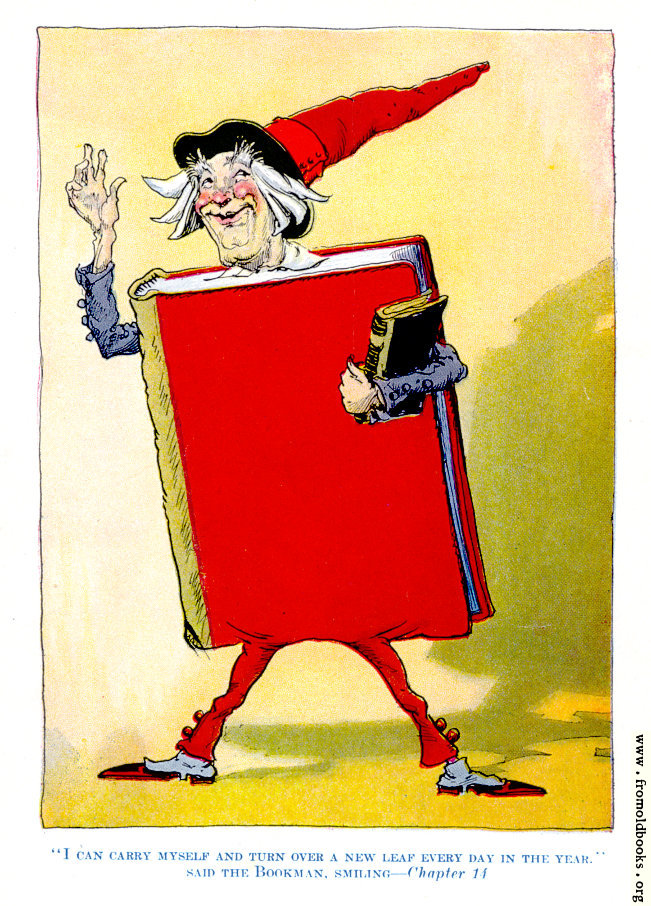

  

<h1 align="center">Bookman</h1>

  <strong>Turn your AI into your personal book mentor.</strong>

  Transform books into lasting knowledge through structured notes,
  concept extraction, active recall, and meaningful connections.

  <i>Read once. Learn forever.</i>

---

> *"Books are old fashioned, but a bookman is right up to date. I don't wait to be advertised, I speak for myself. I don't lie around waiting to be read, I run after people and make them read me."*
>
> — **The Bookman**, *The Gnome King of Oz* (1927)

  Illustration and quote taken from Ruth Plumly Thompson, <i>The Gnome King of Oz</i> (1927) — out of copyright / public domain in the USA. Used with credit as requested by the source.

